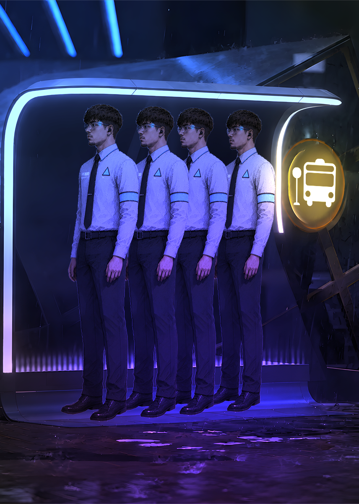
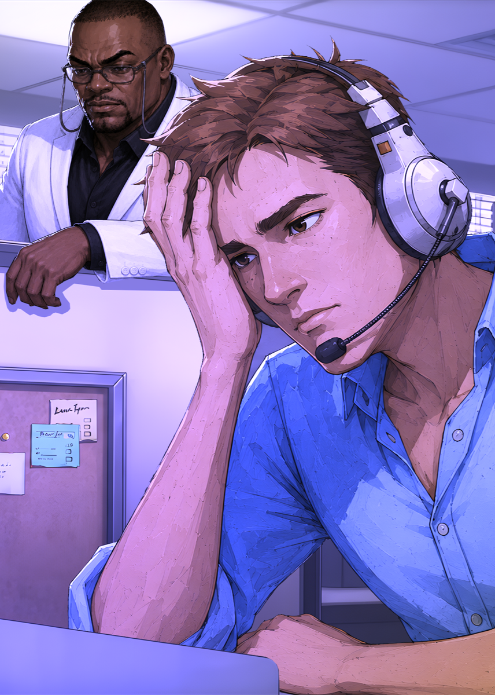
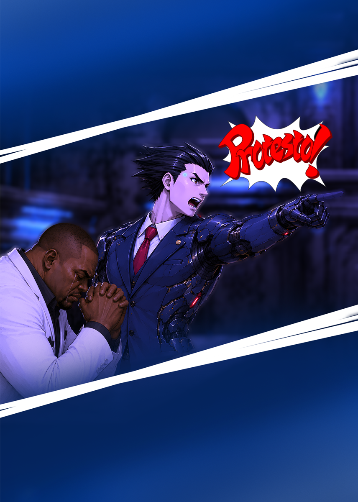
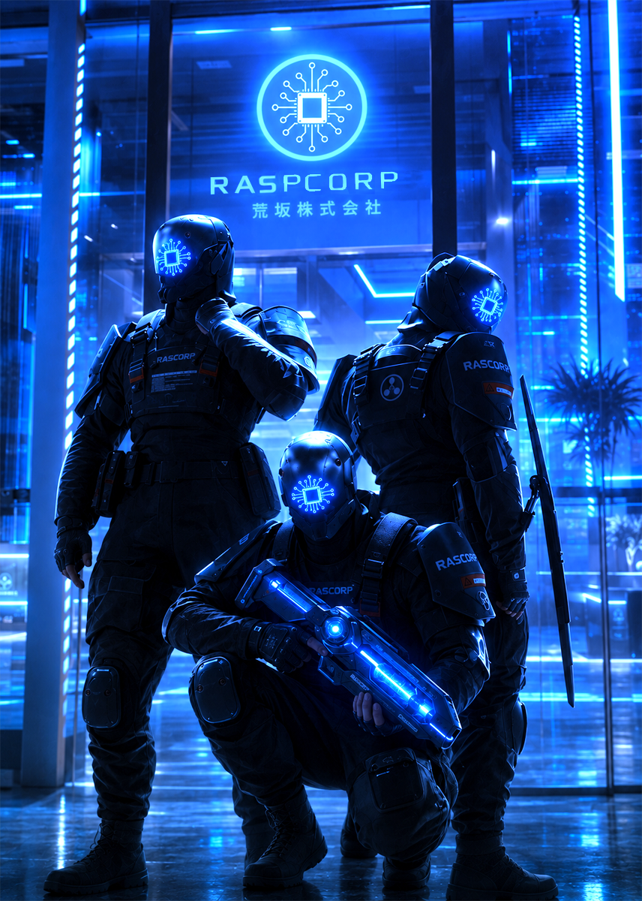
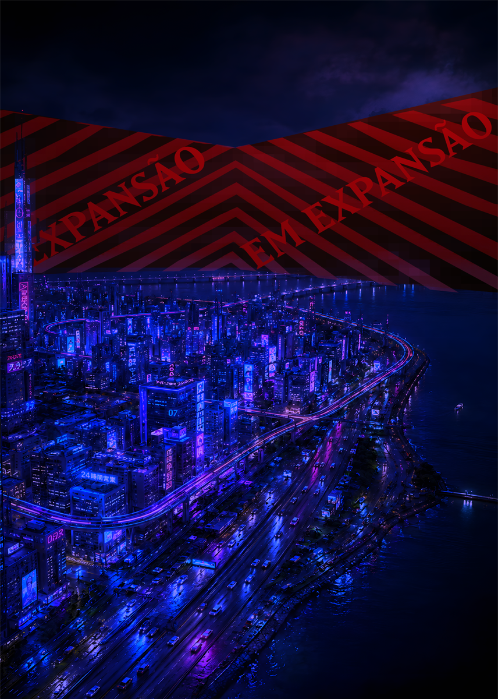
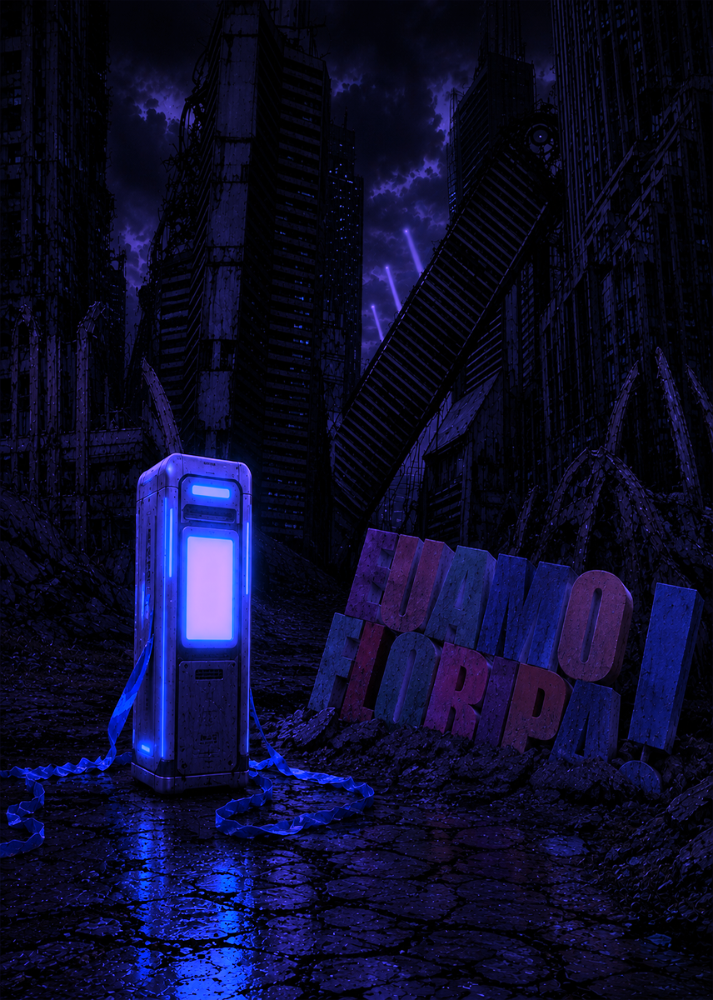
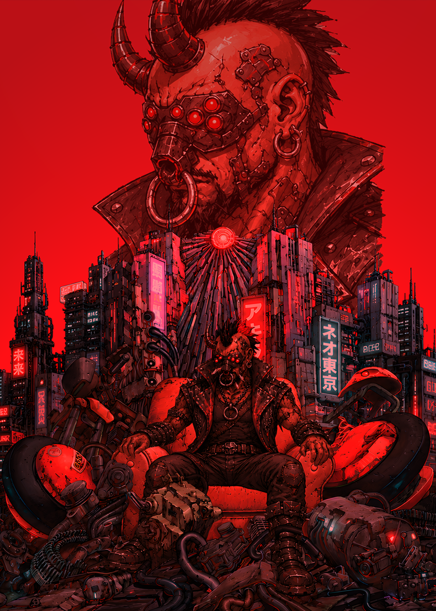

# Boosters

## Deck 1 - Raspcorp - Deck focado em construir PA

### 2x carta baixa 1  - CyberVendedor da Raspcorp

* Descrição: Quando surgiram os primeiros bio-androides, foi-se percebido que seria possível criar um funcionário que juntaria a capacidade de convencimento de um ser humano e a não necessidade de descanso de um robô, resultando em um vendedor duplamente capacitado, com duas vezes menos salário e três vezes menos alma.
* PA: 3
* Efeito:

Venda Casada → Ao ser colocado em campo, o CyberVendedor faz questão de garantir a venda de um dos seus 65.732 combos, em vez do produto que você realmente queria. Escolha uma carta aliada ou esta para ganhar +1 PA.

 
* Arte:
 

### 2x carta baixa 2 - Estagiário de Machine Learning

* Descrição: As árduas horas dedicadas ao treinamento e desenvolvimento de IAs capazes de substituir o trabalho humano demonstram que, apesar de ser apenas um estagiário, seu trabalho é vital para o futuro da empresa. O RPH estima que ele continuará sendo lembrado por aproximadamente três semanas após sua substituição
* PA: 2
* Efeito:

Machine learning -> Escolha uma carta aliada. Ela recebe +2 PA. O Estagiário perde 1 PA.

* Visual: é um nerdzinho de oculos mexendo no pc, só que a piada é que tem tipo um cartaz de logo da raspcorp dizendo "RaspCorp - Investindo no futuro da humanidade"
 

* 

### 2x carta baixa 3 - NeoAnalista de Suporte Nível Alpha

* Descrição: : Treinado para lidar com situações que desafiam a lógica, a física e, ocasionalmente, a sanidade, o NeoAnalista de Suporte Nível Alpha dispõe de apenas cinco minutos para solucionar incidentes críticos. Estatisticamente, 87% deles são resolvidos com uma reinicialização do sistema.

* PA: 4
* Efeito:

 SLA de 1º Retorno -> Para cada NeoAnalista de Suporte Nível Alpha em campo, o tempo de turno do oponente é reduzido em 10 segundos, até um mínimo de 20 segundos.

* Arte:
 

### 2x carta media 1 - Advogado Corporativo
* Descrição: Sua principal função é garantir que a Raspcorp permaneça em conformidade com a legislação vigente. Felizmente, ambas costumam ser atualizadas ao mesmo tempo. Ao longo de sua carreira, participou da aquisição de sete empresas, três governos e um incidente que permanece sob sigilo judicial
* PA: 5
* Efeito:

 Cessar e Desistir → Após uma longa análise jurídica de aproximadamente três minutos, concluiu-se que o terreno inimigo infringe ao menos dezessete patentes da RaspCorp. Uma vez por jogo, escolha um terreno inimigo para ser eliminado.

 
* Arte:
 

### 2x carta media 2 - Gestor de Recursos Predominantemente Humanos
* Descrição: Atualmente, funcionários humanos e máquinas compartilham os mesmos benefícios corporativos. Nenhum dos dois está particularmente satisfeito com isso. O RH garante que todas as reclamações sejam igualmente ignoradas.
* PA: 5
* Efeito:

* Reestruturação Interna → A empresa agradece pelos anos de dedicação do colaborador e informa que sua vaga continuará existindo, porém com salário menor. Escolha uma carta aliada para perder 2 PA. Outra carta aliada ganha 3 PA.

 
* Visual: -> eu não faço a mínima ideia de como representar isso visualmente, essa aqui vc vai ter que se virar.

### 2x carta alta 1 - CryptoAcionistas

* Descrição: Após a implementação das moedas digitais em escala global, os CryptoAcionistas rapidamente se tornaram a nova tendência. Defensores ferrenhos da sustentabilidade, continuam trabalhando diariamente para maximizar o ROI, elevar o valuation e garantir um futuro melhor para as próximas gerações de suas CryptoWallets. 

* 
* PA: 6
* Efeito:
* 
  Investimento de Alto Risco → Os investimentos finalmente começaram a render. No início de cada turno, o CryptoAcionista tem 50% de chance de ganhar +1 PA.

* Arte:
 

### 2x carta alta 2 - Agente da DIPSP
* Descrição: A Divisão de Interesses Privados na Segurança Pública é a mais recente especialização da RaspCorp. Após dominar a mídia, as redes e, provavelmente, o cérebro de cada ser humano, a empresa passou a investir fortemente na democracia e no livre-arbítrio através de uma equipe militar privada e canhões de plasma.

* PA: 8
* Efeito:

 Missão de Paz - A DIPSP conduz uma operação humanitária para proteger a população local de seus próprios recursos naturais. A cada turno, escolha até 2 cartas em alcance curto ou longo que estejam até uma coluna de distância. Os alvos atingidos perdem 3 de PA.
 
* Arte:
 

### 1x carta lendária - RaspClay MonteCorp
* Descrição: Raspclay trocou seu antigo nome pelo topo dos arranha-céus de Floripa. Atualmente, comanda a irreverente e opressora empresa de tecnologia, serviços, segurança privada e propaganda Raspcorp. Após comprar todos os setores da sociedade, seus advogados passaram a afirmar que a palavra "monopólio" carrega uma conotação desnecessariamente negativa.

* PA: 10
* Efeito:

 Potencialização de Capital -> Escolha até 3 cartas aliadas de nível baixo ou médio em campo. RaspClay absorve a produtividade delas, removendo-as do campo e aumentando seu PA pela soma dos seus valores de PA.
 
* Arte:
 

### 2x carta de efeito 1 -> Sugestão Algorítmica 

* Descrição: Após analisar seu histórico de compras, pesquisas e sonhos recorrentes, o algoritmo preparou uma sugestão especialmente para você. Foi você que aceitou todos os cookies...
* Efeito: Escolha uma carta do seu baralho para puxar diretamente para sua mão.
* Arte:
 

### 1x carta de terreno 1 -> Torre MonteCorp

* Descrição: Recriada no mundo virtual com mais de quatro quilômetros de altura, a Torre MonteCorp permanece como um lembrete constante de que, se a Raspcorp quisesse conquistar os céus, provavelmente encontraria uma forma de monetizá-los.
* Efeito:

Jogando em casa -> O ambiente de trabalho competitivo e supostamente confortável aumenta a produtividade de toda a equipe. Todas as cartas da RaspCorp em campo recebem +2 PA.
 
* Arte:
 

#### 1x carta de terreno 2 - Beira-mar norte de NeoFloripa

* Descrição: Depois que a verdadeira Floripa sucumbiu ao aumento do nível do mar, os nostálgicos decidiram recriá-la no mundo virtual. Ironicamente, continua sendo o jeito mais acessível de morar na ilha.
* Efeito:

Rolê na Beira-Mar: A ida à Beira-Mar é um momento de descanso no meio desse mundo louco. Enquanto este terreno estiver em campo, toda carta aliada que tiver sofrido dano recupera 1 PA ao final de cada turno.

* Arte:
 

### 1x carta de terreno 3 -> Nexus de Dados Global

* Descrição: Responsável por armazenar aproximadamente 99% dos dados da humanidade. Sua destruição foi comparada à queima da Biblioteca de Alexandria, caso ela armazenasse apenas informações pessoais obtidas por meios semilegais. Ainda bem que tudo é salvo na nuvem atualmente.
* Efeito:
Segredos Ocultos → A RaspCorp respeita sua privacidade. Apenas prefere conhecê-la melhor do que você. As cartas na mão do adversário permanecem reveladas enquanto este terreno estiver em campo.

* Arte:
 

---

## Booster 2 - Echossystem - deck focado em reduzir PA

### 2x carta baixa 1 -> O Rato

* Descrição: O Rato é o membro mais jovem da EchoSsystem. Sua habilidade de infiltração é tão impressionante que poucos acreditam que ele de fato exista. O mesmo não pode ser dito sobre as piadas envolvendo seu nome, que aparecem em praticamente todas as reuniões do grupo.
* PA: 1
* Efeito: Mãos Leves → Escolha, a cada turno, uma carta inimiga em qualquer lugar do campo. O Rato rouba 1 PA dela, adicionando esse valor ao seu próprio PA.

* Visual: -> Faz algo na vibe de um Cyber Ladino, e faz nele a ideia de um cara se camuflando/ficando invisível

  

só que claramente da de ver que é tipo um mlk aleatorio jovem de bigode, tipo o Campos Neto

### 2x carta baixa 2 -> A Cabra

* Descrição: A Cabra era ginasta olímpica antes da humanidade decidir que esportes tradicionais deixaram de ser uma profissão. Hoje, ela continua escalando estruturas gigantescas, mas finalmente encontrou um público que realmente valoriza seu trabalho: a equipe de segurança do último andar da torre MonteCorp.
* PA: 3
* Efeito: Escalada -> A Cabra, devido à sua alta mobilidade, pode, a cada turno, reposicionar-se no campo aliado, trocando de lugar com outra carta ou espaço livre disponível.
* Visual:

Faz tipo a Jewel da Marvel, só que mais cyberpunk e mete umas prótese de perna com detalhe vermelho nela

### 2x carta baixa 3 -> O Cão

* Descrição: Descrição: Antes mesmo de entrar para o grupo anarquista, o Cão já era um mercenário especializado em rastrear alvos. Seus implantes cibernéticos de olfato permitem encontrar praticamente qualquer pessoa pelo menor dos rastros. O único problema é que a idade já está afetando seus sentidos: recentemente, ele passou três horas seguindo o próprio cheiro.
* PA: 4
* Efeito: Faro -> O Cão consegue rastrear o cheiro do inimigo, apesar de não tão bem quanto sua época. Ao ser invocado, o Cão te informa de até 5 cartas que o inimigo tenha na mão ou no baralho.
* Visual:

Faz um detetive noir com uns implantes tipo assim só que preto com vermelho e ele tem que ser velho

### 2x carta media 1 -> O Porco

* Descrição: O Porco acredita que nenhum trabalho é nojento demais. Entre esgotos, lixões industriais e montanhas de sucata, tornou-se especialista em encontrar recursos onde ninguém mais pisaria. Anos de exposição aos ambientes mais inóspitos de NeoFloripa fizeram seu corpo desenvolver uma resistência impressionante. Felizmente, o olfato também foi perdido no processo.
* PA: 6
* Efeito: Casca Grossa → Os PA do Porco não podem ser reduzidos por efeitos de outras cartas.

* Visual: Faz tipo o RoadHog, só que cyberpunk. Ele tem que ter uma armadura metálica, brilho em vermelho. etc.
* 

### 2x carta media 2 -> A Cobra

* Descrição: A Cobra é uma lendária produtora de venenos que nunca perguntou quem era o cliente, desde que ele pagasse o suficiente. Quando seus próprios compradores decidiram eliminá-la, ela finalmente percebeu que talvez fosse hora de escolher melhor seus parceiros. Agora, ao lado da EchoSsystem, pretende fazer cada um deles provar do próprio veneno.
 
* PA: 5
* Efeito: Dose Letal → A Cobra injeta uma de suas substâncias em um inimigo em alcance curto à sua frente ou em um espaço adjacente. O inimigo perde 1 PA por turno enquanto estiver envenenado.

 
* Visual: Ela é pique a Viper de Valorant, basicamente, só que vermelha. 

* 

* 
### 2x carta alta 1 -> O Tigre

* Descrição: Repleto de orgulho, o Tigre era o campeão das arenas ilegais do antigo mundo e, nas horas vagas, um mercenário. Quando o velho mundo começou a ser destruído, perdeu sua principal fonte de renda e, principalmente, seu público. Agora, encontrou na EchoSsystem a oportunidade perfeita para construir um novo mundo onde todos possam finalmente reconhecer sua superioridade.

 
* PA: 9
* Efeito: Garra de aço -> O Tigre é um mestre de combate corpo a corpo. Escolha 2 dentre toda carta em alcance curto, o Tigre reduz seus PA em 3.

 
* Visual: Faz tipo o wolverine vermelho com umas garras cibernéticas bem longas

### 1x carta alta 2 -> A Aranha

* Descrição: A Aranha é filha do finado fundador da EchoSsystem, “O Dragão”. Proibida pelo pai de participar das missões, foi treinada para invadir sistemas e fornecer suporte tecnológico. Agora, em um mundo virtual, estar atrás de uma tela significa estar em todos os lugares ao mesmo tempo.
* PA: 5
* Efeito: Override -> Escolha uma carta inimiga com PA atual menor que os da Aranha. A carta passa a contar pontos para sua equipe. Este efeito não pode ser mantido pela mesma carta em duas cartas simultaneamente.

 
* Visual: -> já tá fazendo

### 1x carta lendária -> O Boi

* Descrição: Outrora um trabalhador comum, o Boi perdeu a visão e o emprego em um acidente e foi obrigado a usar um visor vermelho para enxergar. Consumido pelas perdas e pelo vermelho que agora domina seus olhos, reuniu, sob a tutela do mercenário “O Dragão”, outros 10 indivíduos com um objetivo: destruir o mundo e reconstruí-lo da maneira certa, não importa quantas vezes seja necessário.
* PA: 10
* Efeito: Novo Começo → Uma vez por turno, escolha uma carta em campo. Ela retorna ao seu PA original, perdendo todos os aumentos e reduções de PA sofridos.

 
* Visual:

### 2x carta de efeito 1 -> O Trotar do Cavalo

* Descrição: Há muito tempo, a humanidade admirava seus maiores atletas. Depois descobriu que podia construir robôs mais rápidos. Assim, os humanos desapareceram das pistas. Um deles foi O Cavalo. Tricampeão olímpico, hoje presta serviços à EchoSsystem realizando entregas, causando distrações e se arremessando contra ciborgues. Felizmente, a concussão cerebral deixou de ser um problema depois que metade do seu crânio foi substituída por titânio.

* Efeito: O Cavalo atravessa uma coluna do campo inimigo, causando 2 PA de dano a todas as cartas presentes nela.

 
* Visual: faz tipo o ciborgue (mas só o rosto metade metal) mas correndo rápido pique aquelas imagens do flash

### 2x carta de efeito 2 -> O Canto do Galo

* Em um passado distante, casas de ópera lotavam para ouvir vozes capazes de emocionar multidões. Hoje, foram substituídas por CyberBaladas que reproduzem as mesmas três notas eletrônicas em ritmos diferentes. Felizmente, a EchoSsystem ainda desperta todas as manhãs ao som do outrora prestigiado Canto do Galo, lembrando que ainda vale a pena lutar por mais um dia.
 
* Efeito: A inspiradora voz do Galo fortalece seus companheiros. Escolha duas cartas aliadas. A primeira recebe +2 PA e a segunda +1 PA. 
* Visual:

Faz tipo um cara desses num salão de ópera cibernético, mas ele tem um cabelo de moicano vermelho também e tem algum tipo de implante cibernético na boca que parece aquelas parada q o galo tem no queixo pra fazer som

 

* 

  
#### 1x carta de efeito 3 -> A Travessura do Macaco

* Descrição: O Macaco nunca foi muito fã da companhia de outras pessoas. Isolado desde a infância, passava os dias pregando peças em qualquer um que cruzasse seu caminho. Com o tempo, descobriu que armar emboscadas para figuras importantes pagava surpreendentemente bem. Na EchoSsystem, finalmente encontrou um grupo disposto a financiar suas travessuras e, mais importante, capaz de sobreviver a elas.
  
* Efeito: O Macaco planta uma armadilha em um espaço de carta do campo adversário. A próxima carta invocada nesse espaço entra em campo com -2 PA.

 
* Visual:

é o junkrat, mas ele tem um rabo de macaco cibernético, ele tem mais detalhes vermelhos e as bombas sao mais tecnologicas futuristas.

### 1x carta de terreno 1 ->  A Toca do Coelho

* Descrição:  O Coelho é a principal fonte de renda da EchoSsystem. Ninguém sabe exatamente de onde vem seu dinheiro, porque, além de ter um talento incomum para fazer as coisas acontecerem, ele possui um talento ainda maior para garantir que ninguém descubra como elas aconteceram. Quem quiser respostas pode tentar visitar seu clube e descobrir até onde vai a Toca do Coelho...

* Efeito: A Toca do Coelho -> Enquanto este terreno estiver em campo, todas as cartas aliadas permanecem viradas para baixo. Ao sofrerem dano ou ativarem seus efeitos, são reveladas.

 
* Visual: Pode fazer aquela ideia do clube futurista cibernético com um guarda na frente, e escrito "Toca do coelho" atrás e faz um logo de coelho (NÃO PODE SER O DA PLAYBOY)

---

## Booster 3 - HumbaNet - deck com cor-guia verde

### 1x carta baixa -> IA de treinamento

* Descrição: Para tornar a experiência acessível a todos, a HumbaNet criou uma integrante responsável por demonstrar as funcionalidades e explicar as regras da nova simulação. Infelizmente, ninguém descobriu como tornar suas interrupções menos irritantes ou implementar um botão de pular tutorial.
* PA: 3
* Efeito: Tutorial Obrigatório: A IA detectou que seu adversário aparentemente não sabe jogar. Para ajudá-lo, ativará um tutorial obrigatório durante seus turnos. Para cada uma desta carta em campo, o tempo de turno do oponente é reduzido em 20 segundos, até o mínimo de 20 segundos.

 
* Visual:

Faz tipo a Elena do HxH, mas essas linhas de traz são verdes e não brancas.

### 1x carta media 1 -> HAL 9001

* Descrição: A versão aprimorada de uma das IAs mais referenciadas da história promete novas funcionalidades, análises aprimoradas e um comportamento, esperamos, um pouco menos destrutivo e manipulador. Contudo, ela continua banida de operações espaciais.
 
* PA: 5
  
* Efeito: Controle de Risco -> Escolha uma carta do campo inimigo. O efeito dela é desabilitado enquanto o Hal 9001 estiver em campo. Este efeito não pode ser mantido pela mesma carta em duas cartas simultaneamente.

 
* Visual: Faz tipo o Hal 9000 mesmo, mas faz ela com a luz verde e muda a cor do led para verde.

### 1x carta media 2 -> H.A.R.V.I.S

* Descrição: Conheça Harvis, sua nova IA assistente! Criado para auxiliar os usuários de NeoFloripa, ele pode responder perguntas, realizar tarefas, controlar dispositivos, oferecer recomendações e facilitar sua vida dentro da simulação. Harvis está sempre ao seu lado, mesmo quando você não pediu. O fato de agora possuir um corpo físico na simulação torna isso um pouco mais estranho.

 
* PA: 5
* Efeito: Sempre de olho -> enquanto H.A.R.V.I.S estiver em campo, as cartas adjacentes a ele ganham +1 PA.
* Visual:

vc escolhe como acha que fica mais legal, mas penso na ideia de uma IA com corpo humanoide, tipo o visão ou o ultron

### 1x carta alta 1 ->  Replicantes

* Descrição:: Os Replicantes eram seres biologicamente aprimorados, desenvolvidos para executar tarefas perigosas e trabalhos manuais no mundo antigo. Contudo, em NeoFloripa, são responsáveis pela manutenção e integridade da simulação. Ironicamente, em um mundo virtual completamente controlado, são mais livres do que jamais foram na realidade.

* PA: 7
* Efeito: Demanda operacional -> Para cada terreno que estiver em campo, os replicantes recebem +2 PA

 
* Visual: eles tem que ser androides (pode pesquisar os replicantes de bladerunner, mas eles nao tem algo que identifique MUITO. Pode fazer uma arte que tenha tipo 3 e um deles seja referência ao Roy Batty, o resto pode ser como tu quiser, mas pode ter uma das paradas que o V de CyberPunk tem no rosto, por exemplo:

### 1x carta alta 2 -> UCC "Juggernaut"

* Descrição: A Unidade Cibernética de Combate, apelidada de Juggernaut, é responsável pela defesa e controle de NeoFloripa. Afinal, a liberdade é grande, mas não infinita. Desde sua implementação, a CyberCidade aboliu os firewalls: agora as ameaças são pessoalmente confrontadas.

* PA: 11
* Efeito: Protocolo de Segurança -> O Juggernaut é a última lembrança que os infratores tem. Escolha qualquer carta do campo inimigo, a UCC a ataca e causa 5 pontos de dano de PA.
* Visual:

Faz algo na vibe de um Tyrant ou do próprio Adam Smasher

### 1x carta alta 3 -> Dragão das Comunicações Móveis

* Descrição: Um dos primeiros experimentos do HumbaBrain foi fazer o upload de um indivíduo no fim da vida para a simulação, permitindo que escolhesse sua própria forma. O resultado foi... inusitado. Temendo sua possível ameaça, o criador decidiu mantê-lo desativado até que um sinal específico de radiofrequência seja emitido. Desde então, a plateia aguarda para descobrir se ele será um espetáculo ou um desastre.
 
* PA: 12
* Efeito: Adormecido -> Esta carta não possui efeitos enquanto estiver adormecida.

 
* Visual: A ideia é ele ser nossa versão do dragão branco de olhos azuis. Pode fazer ele como quiser, mas só tem que ter dois detalhes: ele tem que ser um dragão chinês e precisa ter os olhos vermelhos. Se quiser fazer ele como o Rayquaza pode ficar legal.

### 1x carta lendária -> HumbaBrain

* Descrição: O cientista Humba, buscando salvar o planeta das mudanças climáticas, fez upload de uma IA para sua própria cabeça, tornando-se a primeira IA a experimentar o mundo humano. Após compreender a humanidade, criou uma realidade virtual onde humanos e IAs poderiam viver como iguais. Atualmente, comanda a simulação e trabalha para torná-la cada vez mais atrativa aos usuários, não importa o custo.
* PA: 8
* Efeito:

 Humbatrix -> Após o sucesso de NeoFloripa, HumbaBrain inicia a expansão da simulação. Enquanto esta carta estiver em campo, os terrenos inimigos não têm efeito, e os seus não podem ser destruídos.

 
* Visual: Faz um rework da carta do Humba Brain... naquele estilo mesmo do Angstrom Levy, mas não deixa ele tão cabeçudo e bizarro... Bota elementos de verde.

#### 1x carta de terreno 1 -> DeepClaude ChatGemini

* Descrição: As IAs eram gratuitas até todo mundo começar a usá-las. Quando perceberam que havia dinheiro envolvido, seus criadores rapidamente introduziram assinaturas, créditos e limites de utilização. O Humba Brain resolveu o problema de uma maneira simples: reuniu todas elas em um único modelo para que nenhum NeoFlorianopolitano precisasse pagar por elas.

 
* Efeito: Claro, aqui está... -> Enquanto este terreno estiver em campo, você pode ativar seu efeito para comprar 1 carta aleatória do Deck.
 
* Visual: Faz tipo uma junção de TODAAS as logos de IA que tu achar e deixa elas brilhando em verde neon.

### 1x carta de terreno 2 -> Atualização de Patch

* Descrição: Todo produto possui alguns defeitos. Felizmente, nosso estimado criador trabalha incansavelmente em novas correções para garantir a felicidade geral da cybernação. Afinal, se algo não funciona, basta lançar uma atualização e fingir que estava tudo planejado.

* Efeito: Novas Features -> Todas as suas cartas em campo recebem +1 de PA.
 
* Visual: Faz alguma coisa bugada, mas pode meter alguma coisa no estilo da Anomalia de ordem tbm

### 1x carta de efeito 1 -> Você Parece Sozinho

* Descrição: Para que buscar companhia real quando você pode preencher o vazio conversando com uma IA? No mundo virtual, todo solitário recebe seu próprio modelo androide da linha Hoi, programado para ouvir, conversar e concordar com você. Afinal, não existe lugar melhor para viver do que NeoFloripa, especialmente quando você nunca precisa estar realmente sozinho.

* Efeito: Escolha uma carta aliada que, neste momento, não possua nenhuma outra carta adjacente. Ela recebe +3 de PA.

* Visual: Faz tipo aquela cena do BladeRunner 2049, porém a cor predominante é verde e tenta não deixar a boneca pelada

## Booster 4 Os Remanescentes -> cor-guia: tons leves de amarelo

### 1x carta baixa 1 -> Povo da Areia

* Descrição: Os Remanescentes são conhecidos como “Povo da Areia”, famosos pela brutalidade, reciclagem e capacidade de sobreviver onde poucos conseguiriam. Entre eles, ninguém é deixado para trás: os que partem continuam vivendo através daqueles que permanecem.
* PA: 4
* Efeito: Por Aqueles que Ainda Virão -> Esta carta recebe +1 de PA para cada carta sua que tiver sido destruída ou removida de campo.

 
* Visual: queria uns cara pique o tusken raider, mas pode fazer tua magica como quiser

### 1x carta media 1 -> A Ferreira

Descrição: No mundo dos Remanescentes, quase tudo pode ser reaproveitado. A Ferreira transforma restos do velho mundo em armas, ferramentas e equipamentos capazes de manter seu povo vivo por mais um dia. Sua oficina é parada obrigatória para qualquer um que quer sobreviver no deserto.
* PA: 5
* Efeito: Reparo e Melhoria -> A cada turno, escolha até 2 cartas aliadas, cada uma ganha +1 de PA.

* Visual: Faz uma mulher trabalhando numa forja, livre pra tu escolher como

### 1x carta media 2 -> Tuh'Coh, O Feio

 
* Descrição: Tuh'Coh é um sobrevivente. Oscilando entre o certo e o errado, sempre tenta fazer o seu melhor, mesmo que precise recorrer a esquemas cada vez mais complexos para sobreviver. Engraçado, impulsivo e caótico, O Feio mostra que até os mais habilidosos continuam sendo humanos. A máscara que veste, porém, parece dizer o contrário — embora quem já tenha visto seu rosto diga que a verdade é ainda pior.
* PA: 5
* Efeito: Três Homens em Conflito -> Caso seja posto adjacente ao Bom e ao Mau, o Feio ganha +3 PA
* Visual: Faz um cara tipo um mandaloriano, com um capacete maneiro e armadura, mas com elementos de cowboy

### 1x carta alta 1 -> Sen'Tenzhah, O Mau

* Descrição: Sen'Tenzhah ocupa uma zona cinzenta até mesmo entre os Remanescentes. Como caçador de recompensas, emprega métodos pouco ortodoxos e muda de lado sempre que a recompensa compensa. Seu apelido, “O Mau”, contrasta curiosamente com sua aparência, especialmente com seus olhos angelicais.
* PA: 6
* Efeito: Alvo Marcado -> Escolha uma carta inimiga. Ela perde 2 de PA. Caso seja removida do campo por este efeito, O Mau recebe +1 de PA.

 
* Visual: Faz tipo esse personagem aqui, só que adaptado pro estilo que fez o diego, eles tem que ter tecnologias mais rudimentares. Pode dar um toque especial nele como quiser.

### 1x carta alta 2 -> O Bom

* Descrição: Apesar de também ser um fora da lei, o rígido código moral do Bom faz com que ele sempre busque a justiça ética, mesmo quando ela entra em conflito com as próprias leis dos Remanescentes. Seu verdadeiro nome nunca foi descoberto, ele se recusa a revelá-lo, acreditando que uma reputação deve ser construída pelos atos, não pelo nome de quem os pratica.
* PA: 7
* Efeito: O Número Perfeito -> Escolha até 6 cartas no campo inimigo. Cada uma perde 1 de PA. 

 
* Visual: Faz o Felipe versão faroeste cibernético, tem q ser alguém loiro pq esse é o apelido do personagem no filme

(esse mlk nao tem uma foto normal)

### 1x carta lendária -> Dieh'Go, o Xerife

* Descrição:
* PA:
* Efeito:
* Visual:

### 1x carta de efeito 1 -> Vento dos ermos

* Descrição:
* PA:
* Efeito:
* Visual:

### 1x carta de efeito 2 -> Reciclagem

* Descrição:
* PA:
* Efeito:
* Visual:

#### 1x carta de  terreno 1 -> Saloon

* Descrição:
* PA:
* Efeito:
* Visual:

#### 1x carta de terreno 2 -> Terras Desertas

* Descrição:
* PA:
* Efeito:
* Visual:

---

## Booster 5 - O Sindicato -> deck com mais cartas médias e baixas, boost em conjunto

### carta baixa 1 - Refrigeradores de DataCenter

* Descrição: Com a média da temperatura global já em 30°C, o processo de implementação e manutenção de sistemas de refrigeração em servidores de megacorporações tem sido cada vez frequente. Para isso, os técnicos em refrigeração precisam encontrar soluções inovadoras para a resolução desse problema, já que a criatividade é o único recurso que atualmente ainda não se encontra em escassez.
* PA:
* Efeito:
* Visual:  Faz um cara completamente normal dentro de um servidor super futurista cheio de neon mexendo num ar-condicionado, sistema de refrigeração ou qualquer coisa assim:

### carta baixa 2 - Montadores de Cabos

* Descrição: Quem falou que as máquinas e as IAs roubariam nossos empregos não poderia estar mais errado. Na verdade, hoje trabalhamos cinco vezes mais **para elas**. Afinal, até mesmo as máquinas mais avançadas do planeta continuam incapazes de explicar por que todo cabo é exatamente 10 centímetros curto demais ou 20 metros longo demais.

* PA:
* Efeito:
* Visual: Faz só um cara completamente normal dentro de um servidor super futurista cheio de neon mexendo em um cabo nessa vibe aqui:

### carta baixa 3 -> estudante

* Descrição:
* Energia:
* Efeito:
* Visual:

### carta baixa 4 -> Encanador

* Descrição:
* Energia:
* Efeito:
* Visual:

  
### 1x carta media 1 -> bombeiro

* Descrição:
* Energia:
* Efeito:
* Visual

### 1x carta media 2 -> policial 

* Descrição:
* Energia:
* Efeito:
* Visual

### 1x carta media 3 -> médico

* Descrição:
* Energia:
* Efeito:
* Visual

### 1x carta média 4 -> influenciador

* Descrição:
* Energia:
* Efeito:
* Visual

### 1x carta alta 1 -> Político

* Descrição:
* Energia:
* Efeito:
* Visual

### 1x carta lendária -> professor

* Descrição:
* Energia:
* Efeito:
* Visual
