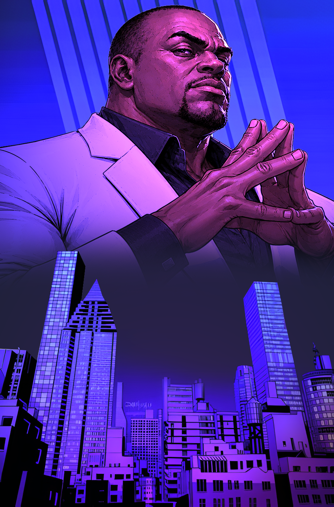
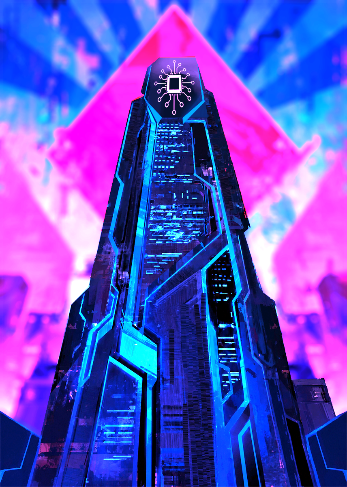

# Boosters

## Deck 1 - Raspcorp - Deck focado em controle de terreno e personagens 

### 2x carta baixa 1  - CyberVendedor da Raspcorp

* Descrição: Quando surgiram os primeiros bio-androides, foi-se percebido que seria possível criar um funcionário que juntaria a capacidade de convencimento de um ser humano e a não necessidade de descanso de um robô, resultando em um vendedor duplamente capacitado, com duas vezes menos salário e três vezes menos alma.
* PA: 3
* Efeito:

 
* Arte:
 

### 2x carta baixa 2 - Estagiário de Machine Learning

* Descrição: As árduas horas dedicadas ao treinamento e desenvolvimento de IAs capazes de substituir o trabalho humano demonstram que, apesar de ser apenas um estagiário, seu trabalho é vital para o futuro da empresa. O RPH estima que ele continuará sendo lembrado por aproximadamente três semanas após sua substituição
* PA: 2
* Efeito: o código
 
* Visual: é um nerdzinho de oculos mexendo no pc, só que a piada é que tem tipo um cartaz de logo da raspcorp dizendo "RaspCorp - Investindo no futuro da humanidade"
 

* 

### 2x carta baixa 3 - NeoAnalista de Suporte Nível Alpha

* Descrição: : Treinado para lidar com situações que desafiam a lógica, a física e, ocasionalmente, a sanidade, o NeoAnalista de Suporte Nível Alpha dispõe de apenas cinco minutos para solucionar incidentes críticos. Estatisticamente, 87% deles são resolvidos com uma reinicialização do sistema.

* PA: 4
* Efeito:

 SLA de 1º Retorno: Para cada NeoAnalista em campo, o tempo de turno do oponente é reduzido em 10 segundos, não podendo ficar abaixo de 20 segundos.

* Arte:
 

### 2x carta media 1 - Advogado Corporativo
* Descrição: Sua principal função é garantir que a Raspcorp permaneça em conformidade com a legislação vigente. Felizmente, ambas costumam ser atualizadas ao mesmo tempo. Ao longo de sua carreira, participou da aquisição de sete empresas, três governos e um incidente que permanece sob sigilo judicial
* PA: 5
* Efeito:

 Cessar e desistir -> O advogado da RascpCorp garante que a única parte livre do mercado seja o caminho para o crescimento da empresa. O último terreno invocado no campo inimigo sofre uma ação judicial que o obriga a fechar
* Arte:
 

### 2x carta media 2 - Gestor de Recursos Predominantemente Humanos
* Descrição: Atualmente, funcionários humanos e máquinas compartilham os mesmos benefícios corporativos. Nenhum dos dois está particularmente satisfeito com isso. O RH garante que todas as reclamações sejam igualmente ignoradas.
* PA: 5
* Efeito:
* Visual: -> eu não faço a mínima ideia de como representar isso visualmente, essa aqui vc vai ter que se virar.

### 2x carta alta 1 - CryptoAcionistas

* Descrição: Após a implementação das moedas digitais em escala global, os CryptoAcionistas rapidamente se tornaram a nova tendência. Defensores ferrenhos da sustentabilidade, continuam trabalhando diariamente para maximizar o ROI, elevar o valuation e garantir um futuro melhor para as próximas gerações de suas CryptoWallets. 

* 
* PA: 6
* Efeito:
* 
 Investimento de alto risco - Os rendimentos dos investimentos começam a dar fruto, o CryptoAcionista tem 20% de chance de aumentar 1 de PA a cada turno

* Arte:
 

### 2x carta alta 2 - Agente da DIPSP
* Descrição: A Divisão de Interesses Privados na Segurança Pública é a mais recente especialização da RaspCorp. Após dominar a mídia, as redes e, provavelmente, o cérebro de cada ser humano, a empresa passou a investir fortemente na democracia e no livre-arbítrio através de uma equipe militar privada e canhões de plasma.

* PA: 9
* Efeito:

 Missão de Paz - a DIPSP realiza uma investida para assegurar a paz (e recursos valiosos) no inimigo, Reduzindo 3 PA em uma linha de 2 à sua frente
 
* Arte:
 

### 2x carta de efeito 1 -> Sugestão Algorítmica 

* Descrição: Após analisar seu histórico de compras, pesquisas e sonhos recorrentes, o algoritmo preparou uma sugestão especialmente para você. Foi você que aceitou todos os cookies...
* PA:
* Efeito:
* Arte:
 

### 1x carta de terreno 1 -> Torre Montecorp

* Descrição: Com mais de quatro quilômetros de altura, a Torre MonteCorp permanece como um lembrete constante de que, se a Raspcorp quisesse conquistar os céus, provavelmente encontraria uma forma de monetizá-los.
* PA:
* Efeito:
* Arte:
 

#### 1x carta de terreno 2 - Beira-mar norte de NeoFloripa

* Descrição: Depois que a verdadeira Floripa sucumbiu ao aumento do nível do mar, os nostálgicos decidiram recriá-la no mundo virtual. Ironicamente, continua sendo o jeito mais acessível de morar na ilha.
* PA:
* Efeito:
* Arte:
 

### 1x carta de terreno 3 -> Nexus de Dados Global

* Descrição: Responsável pelo processamento de aproximadamente 98% dos dados da humanidade. Os outros 2% permanecem em análise pelo departamento de marketing
* PA:
* Efeito:
* Arte:
 

---

## Booster 2 - Echossystem - deck focado em efeitos

### 2x carta baixa 1

* Descrição:
* PA:
* Efeito:
* Visual:
### 2x carta baixa 2

* Descrição:
* PA:
* Efeito:
* Visual:

### 2x carta baixa 3

* Descrição:
* PA:
* Efeito:
* Visual:

### 2x carta media 1

* Descrição:
* PA:
* Efeito:
* Visual:
* 
### 2x carta media 2

* Descrição:
* PA:
* Efeito:
* Visual:
* 
### 2x carta alta 1

* Descrição:
* PA:
* Efeito:
* Visual:

### 1x carta alta 2

* Descrição:
* PA:
* Efeito:
* Visual:

### 1x carta lendária

* Descrição:
* PA:
* Efeito:
* Visual:

### 2x carta de efeito 1

* Descrição:
* PA:
* Efeito:
* Visual:

### 2x carta de efeito 2

* Descrição:
* PA:
* Efeito:
* Visual:

  
#### 1x carta de efeito 3

* Descrição:
* PA:
* Efeito:
* Visual:

### 1x carta de terreno 1

* Descrição:
* PA:
* Efeito:
* Visual:

---

## Booster 3 - Robôs - Deck 

### 1x carta baixa

* Descrição:
* PA:
* Efeito:
* Visual:

### 1x carta media 1

* Descrição:
* PA:
* Efeito:
* Visual:

### 1x carta media 2

* Descrição:
* PA:
* Efeito:
* Visual:

### 1x carta alta 1

* Descrição:
* PA:
* Efeito:
* Visual:

### 1x carta alta 2

* Descrição:
* PA:
* Efeito:
* Visual:

### 1x carta alta 3

* Descrição:
* PA:
* Efeito:
* Visual:

### 1x carta lendária

* Descrição:
* PA:
* Efeito:
* Visual:

#### 1x carta de terreno 1

* Descrição:
* PA:
* Efeito:
* Visual:

### 1x carta de terreno 2

* Descrição:
* PA:
* Efeito:
* Visual:

### 1x carta de terreno 3

* Descrição:
* PA:
* Efeito:
* Visual:

Humberto vai ser o HUMBA BRAIN, que nem o Angstrom de invencível, o criador dos androides

---

## Booster 4 - Nômades das terras desertas -> Sem nada de terreno, deck baseado em personagens e efeitos, imune a efeitos de terreno

### 1x carta baixa 1

* Descrição:
* PA:
* Efeito:
* Visual:

### 1x carta media 1

* Descrição:
* PA:
* Efeito:
* Visual:

### 1x carta media 2

* Descrição:
* PA:
* Efeito:
* Visual:

### 1x carta alta 1

* Descrição:
* PA:
* Efeito:
* Visual:

### 1x carta alta 2

* Descrição:
* PA:
* Efeito:
* Visual:

### 1x carta lendária

* Descrição:
* PA:
* Efeito:
* Visual:

### 1x carta de efeito 1

* Descrição:
* PA:
* Efeito:
* Visual:

### 1x carta de efeito 2

* Descrição:
* PA:
* Efeito:
* Visual:

#### 1x carta de efeito 3

* Descrição:
* PA:
* Efeito:
* Visual:

#### 1x carta de efeito 4

* Descrição:
* PA:
* Efeito:
* Visual:

---

## Booster 5 - O Sindicato -> deck com mais cartas médias e baixas, boost em conjunto

### carta baixa 1 - Técnico em Refrigeração de DataCenter

* Descrição: Com a média da temperatura global já em 30°C, o processo de implementação e manutenção de sistemas de refrigeração em servidores de megacorporações tem sido cada vez frequente. Para isso, os técnicos em refrigeração precisam encontrar soluções inovadoras para a resolução desse problema, já que a criatividade é o único recurso que atualmente ainda não se encontra em escassez.
* PA:
* Efeito:
* Visual:  Faz um cara completamente normal dentro de um servidor super futurista cheio de neon mexendo num ar-condicionado, sistema de refrigeração ou qualquer coisa assim:

### carta baixa 2 - Montadores de Cabos

* Descrição: Quem falou que as máquinas e as IAs roubariam nossos empregos não poderia estar mais errado. Na verdade, hoje trabalhamos cinco vezes mais **para elas**. Afinal, até mesmo as máquinas mais avançadas do planeta continuam incapazes de explicar por que todo cabo é exatamente 10 centímetros curto demais ou 20 metros longo demais.

* PA:
* Efeito:
* Visual: Faz só um cara completamente normal dentro de um servidor super futurista cheio de neon mexendo em um cabo nessa vibe aqui:

### carta baixa 3

* Descrição:
* Energia:
* Efeito:
* Visual:

### carta baixa 4

* Descrição:
* Energia:
* Efeito:
* Visual:

  
### 1x carta media 1

* Descrição:
* Energia:
* Efeito:
* Visual

### 1x carta media 2

* Descrição:
* Energia:
* Efeito:
* Visual

### 1x carta media 3

* Descrição:
* Energia:
* Efeito:
* Visual

### 1x carta média 4

* Descrição:
* Energia:
* Efeito:
* Visual

### 1x carta alta 1

* Descrição:
* Energia:
* Efeito:
* Visual

### 1x carta lendária

* Descrição:
* Energia:
* Efeito:
* Visual

